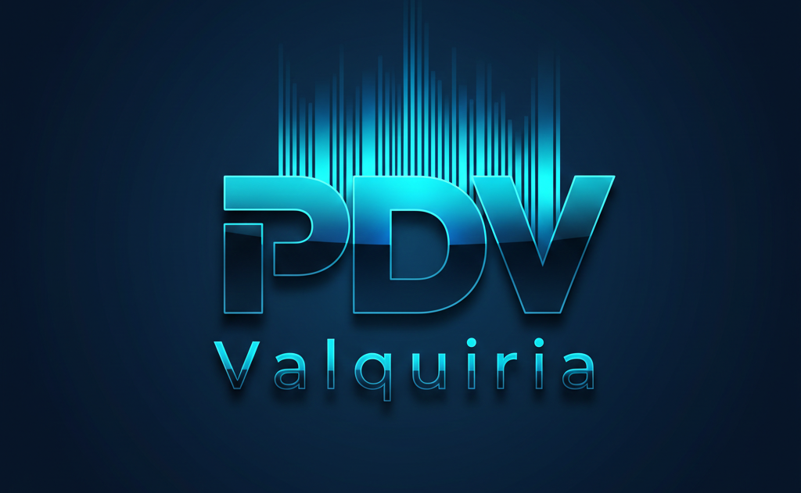

#  Valquíria PDV 

## Deploy [Aqui](https://valquiriapdv.streamlit.app/)

---
O Valquíria PDV ST é um sistema web/desktop leve construído com Python que oferece funcionalidades de PDV, cadastro de produtos, carrinho de vendas, fechamento de vendas, geração de PDF de cupons e relatórios. Ele foi desenvolvido com foco em simplicidade, usabilidade e aplicações em comércios de pequeno porte.

## Funcionalidades Principais

- 🔑 Autenticação de usuários

- 📦 Cadastro de produtos

- 🛒 Carrinho de vendas

- 💰 Fechamento de vendas com totalização

- 🧾 Geração de cupom em PDF

- 📊 Relatórios de vendas

- 📄 Exibição de relatórios simples

- 🗃️ Persistência de dados com SQLAlchemy e banco de dados remoto ou locar (ajustar na configuração do bd)

## Tecnologias Utilizadas

O projeto foi construído principalmente com:

| Camada	| Tecnologia |
| :--- | :--- |
| **Linguagem** | Python |
| **UI / Frontend** | Streamlit |
| **Banco de Dados** | SupaBase (através de SQLAlchemy ORM) |
| **Relatórios PDF** | ReportLab / qrcode |
| **Autenticação** | Serviço interno (autenticação) |
| **ORM** | SQLAlchemy |
| **Persistência** | SupaBase |

Essas tecnologias permitem um sistema leve e fácil de instalar em qualquer máquina com Python, ideal para pequenos comércios.

## Arquitetura e Organização

A arquitetura do Valquíria PDV ST segue um padrão MVC simplificado com divisão em camadas lógicas para facilitar a manutenção e evolução:

```
ValquiriaPDV_ST/
│── app.py                         # Ponto de entrada da aplicação
├── controllers/                   # Lógica de controle entre UI e modelo
├── models/                        # Definições de entidades do banco de dados
├── services/                      # Serviços de negócio e autenticação
├── db/                            # Configurações e inicialização do banco
├── pages/                         # Páginas UI da aplicação (login, vendas, produtos, relatórios)
├── utils/                         # Utilitários, helpers e funções auxiliares
├── img/                           # Imagens usadas na interface
├── requirements.txt               # Dependências do projeto
└── README.md                      # Documentação (este arquivo)
```

## Separação de responsabilidades:

- Controllers — lógica de interação entre UI e dados

- Models — definição de entidades do banco

- Pages — interface de cada parte do sistema

- Services — regras de negócio e autenticação

- Utils — funções auxiliares reutilizáveis

Essa divisão segue boas práticas de arquitetura em camadas, contribuindo para clareza e manutenção do código.

## Fluxo de Uso

### Executar o projeto:

```
git clone https://github.com/Deleon-Santos/ValquiriaPDV_ST.git
pip install -r requirements.txt
streamlit run app.py
```

- 🔑 Login de usuário:
   Usuário acessa a tela de login para entrar no sistema validando a credencial.

- 📦 Produtos:
   Cadastro novos itens no banco de dados.

- 🛒 Vendas:
   Adicione itens ao carrinho a parir do ean ou buscando por descrição e quantidades.

- 🧾 Pagamento:
   Valida o metodos de pagamento e confirme a venda.

- 📊 Relatórios:
   Acompanhe o historico da venda e gera o cupom fiscal em formato pdf.

## Arquitetura em Camadas

O Valquíria PDV ST segue um padrão básico conhecido como Arquitetura em Camadas:

📌 UI / Apresentação
   - Pages (login, produtos, vendas, relatórios)

📌 Camada de Controle
   - Controllers - controla o trafego de consultas ao banco de dados

📌 Lógica de Negócio
   - Services implementa a regra de negocio e conecta a interfce ao banco de dados

📌 Persistência de Dados
   - O banco de dados remoto esta hospedado no SupaBase e garante a percistencia da informação.
   
---

Essa organização isola responsabilidades e é uma escolha comum em projetos de sistemas pequenos a médios, pois equilibra simplicidade e modularidade, facilitando:

- Testes unitários e integrados

- Manutenção do código

- Escalabilidade para futuras features


## Possíveis Evoluções

No futuro, podem ser adicionados:

- 🔄 Backup automático de dados

- 🔐 Sistema de usuários e permissões mais detalhado

- 🧑‍💼 Cadastro de clientes

- 📅 Histórico de vendas com filtros

- 💳 Integração com sistemas de pagamento


## Licença

Projeto open-source disponibilizado sob a licença definida em LICENSE.
